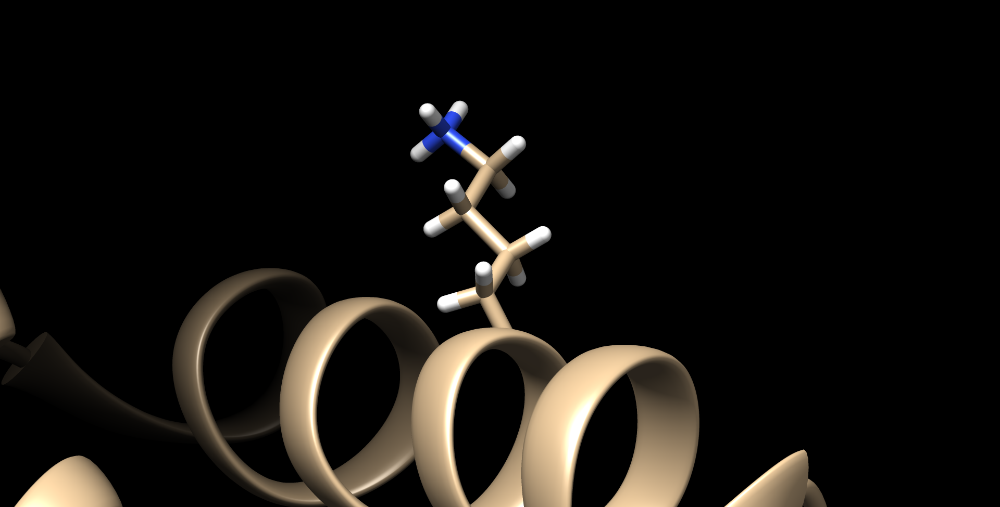
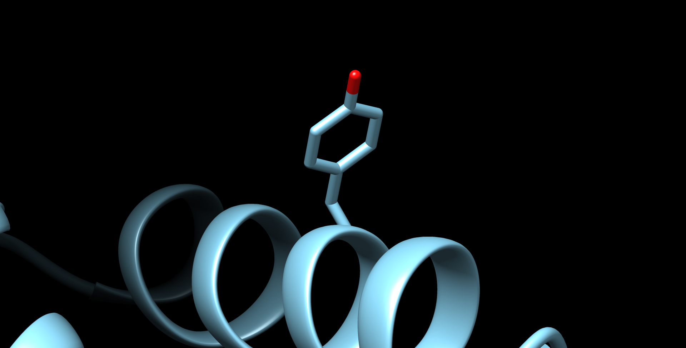

# PyMut

PyMut: A rotamer based mutation library implemented in Python

### Usage:

PyMUT offers a fast and reliable way to introduce mutations using the Biopython

#### Command line tool

    git clone https://github.com/gerdos/pyMUT
    cd pyMUT
    python3 mutate.py test/5e0m.pdb A 44 TYR

If you want to use PyMUT as a python library (recommended) close the repository and place its location inside your `$PYTHON_PATH` environment variable

#### Programmatic usage

    from pymut import *
    from Bio.PDB.PDBIO import PDBIO
    from Bio.PDB import PDBParser

    parser = PDBParser(QUIET=1)
    structure = parser.get_structure("my_structure", "5e0m.pdb")
    all_atoms = list(structure.get_atoms())
    mutate(structure, 'A', 44, 'TYR', mutation_type='first')

    io = PDBIO()
    io.set_structure(structure)
    io.save("test.pdb")

The resulting PDB file will contain the mutation. Please note, that resulting PDB file will only contain ATOM
coordinates.

Original residue             |  Mutated residue
:-------------------------:|:-------------------------:
   |  

### Parameters

The `mutate` function takes the following arguments

Parameter             |  Type  | Default |                                                                                                                                                                        Description                                                                                                                                                                        | Required
:---------------:|:----------:|:--------:|:---------------------------------------------------------------------------------------------------------------------------------------------------------------------------------------------------------------------------------------------------------------------------------------------------------------------------------------------------------:|:---:
chain  |  str | - |                                                                                                                                                    Chain identifier of the residue you want to mutate                                                                                                                                                     | Yes
resnum  |  int | - |                                                                                                                                                Position of the residue you want to mutate in the PDB file                                                                                                                                                 | Yes
mutate_to  |  str | - |                                                                                                                                       3 letter IUPAC amino acid code (only the 20 standard residues are available)                                                                                                                                        | Yes
rotamer_lib  |  object | None |                                                                                                        Preloaded rotamer library returned from the `load_rotamers` function. If not given, it will be loaded separately for each PDB mutation call                                                                                                        | No
mutation_type  |  str | 'first' | How to select the rotamer. 3 possible options: `first`: Select the most likely rotamer based on probability in the library. `random`: Select a rotamer randomly based on the probability in the library. `best`: Select the best rotamer based on VdW energy. `bestother`: Select best rotamer based on VdW energy only considering atoms in other chains | No

### Dependencies

PyMUT requires numpy and Biopython. The current implementation was tested on version 1.19.3+ and 1.7+ respectively

To install numpy on a standard Linux system

    pip3 install numpy
    pip3 install biopython

### Before use

The algorithm assumes continuous neighboring residues, which is required for the dihedral calculations.

N and C terminal residues should be omitted, as the PHI and PSI angles are not defined. The algorithm will assume 0 for
the missing degree

### References, licenses

This project is licensed under the terms of the MIT license.

The rotamer library is based on the following article:

A Smoothed Backbone-Dependent Rotamer Library for Proteins Derived from Adaptive Kernel Density Estimates and
Regressions  *Maxim V. Shapovalov Roland L. Dunbrack Jr.*

The rotamer library is licensed by <a href='https://creativecommons.org/licenses/by/4.0/legalcode' target='_blank'>
Creative Commons CC BY 4.0 license</a>, and can be freely used, modified and distributed. 

    