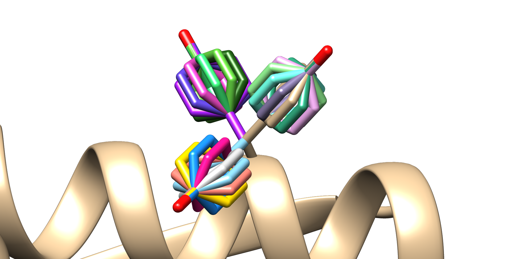

# Summary

Mutations are the essential driving force of evolutions as well as the basis of critical diseases. PyMut is a method to
introduce mutations based on rotamers computationally into PBDs, the most used three-dimensional protein structures
files. Rotamers are a collection of possible orientations residues might take based on their backbone torsion angles
derived experimentally solved high resolution structures. Introduction of rotamers has been shown to be an effective way
to study mutations [@pmid9311930; @pmid2441069]. PyMut uses the 2010 Dunbrack rotamer library [@pmid21645855], which is
a collection of the most likely orientations a residue can be found in biological systems.

PyMut features multiple options to select the desired rotamer, as the highest probability rotamer is often not the
desired one. To account for structural clashes PyMut can select a rotamer based on the Van der Waals energy it would
obtain from neighboring residues and select the one with the minimal energy. For large scale studies rotamers can be
selected randomly based on their respective probabilities from the library.

PyMut is distributed as an importable Python3 library, which is designed for large scale studies. The software has only
one dependency - the numpy library - which is one of the most used external python libraries as of today.

# Statement of need

To study mutations is an everlasting need in the field of molecular biology, and the increasing cost of laboratory
techniques alongside with the vast improvements in the field of informatics lead to the development of bioinformatic
tools to introduce mutations computationally. Most state of the art tools available try to introduce mutations based on
complex energy minimization techniques to achieve the theoretical best solution. This often leads to slow calculations,
and hinders the use of the tool for large scale studies.

PyMut incorporates a more general approach by introducing rotamers and leaving the backbone unchanged. This leads to
less accurate but immensely faster calculation. Applications of PyMut might include the study of simple point mutations,
stereo-chemical properties, but most importantly large scale studies such as alanine scanning of long peptides, or rough
force-field generations where millions upon millions of rotamers are required.

# Description

When a mutation is selected PyMut selected the desired residue from a library that consists of unit vectors of atomic
positions for the selected amino acid derived from experimentally solved high resolution PDB structures from the Protein
Data Bank [@pmid10592235]. Afterwards this residue is mapped to the backbone of the selected position inside the protein
using rigid body transformation. To obtain the rotational and translational component most efficiently PyMut, uses
singular value decomposition of the covariance matrix of the centroid coordinates.

After the selected residue has been placed, PyMut transforms its atomic coordinates based on the selected rotamer. The
desired rotamer can be selected from a handful of rotamers that mach the torsion angles of the selected position by an
optional argument. The three options accepted are 'first', 'random' and 'best'.

* `'first'` selects the rotamer with the highest probability in the library. Rotamers in the library have assigned
  probabilities based on their occurrence in biological systems in respect to the given torsion angles of the residue
* `'random'` selects a random rotamer from the library based on the probability distribution of the matching torsion
  angle rotamers inside the library
* `'best'` the best option tries to guess which rotamer fits best, based on the relative Van der Waals energy it would
  obtain from the residues in close proximity (<6 A). This method is relatively slower compared to the other two
  options, as it checks all possible rotamers

The selected rotamer is applied by rotating the atoms hierarchically based on their respective CHI angles and rotational
axes.

# Examples

PyMut is supplied with three examples. The first is a simple introduction of a TYR residue to the 44th position of the A
chain of the LC8 protein (PDB ID: 5e0m). Generally it is always a good idea to preload the rotamer library and supply
PyMuts function with it, so it does not need to load it for each mutation.

The second example generates an alanine scan for the peptide in the aforementioned PDB. Please note, that the object
created by PyMut is mutable, so a deep copy is created for each example.

The third example creates all the possible conformations a tyrosine might take in the 44th position of the A chain in
5e0m.

{ width=45% }

# Acknowledgements

I acknowledge contributions from Zsuzsanna Dosztanyi and my collegaues from the Department of Biochemistry, Eötvös
Loránd University.

# References

